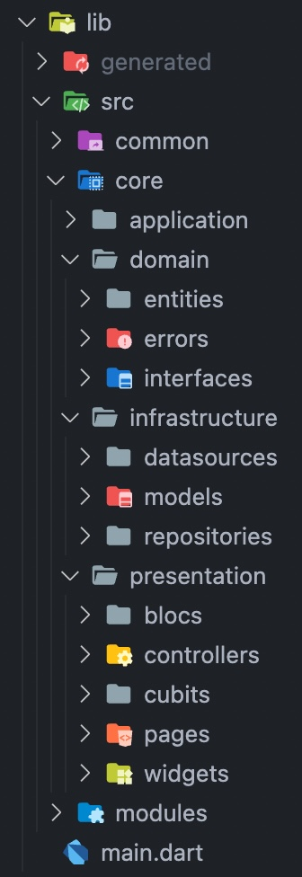

# flutter_base

Base Flutter Project.

## Getting Started

This is a base Flutter project.

A few resources to get you started:

- [Flutter: Multi-Platform Application Development](https://docs.flutter.dev/)
- [Clean Architecture by Robert C. Martin (Uncle Bob)](https://blog.cleancoder.com/uncle-bob/2012/08/13/the-clean-architecture.html)
- [Flutter Firebase & DDD Course](https://resocoder.com/category/tutorials/flutter/firebase-ddd/)

Copyright © 2022 Duc iOS